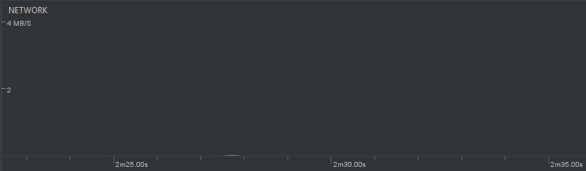
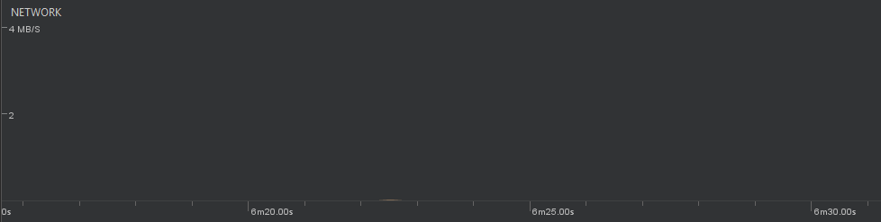
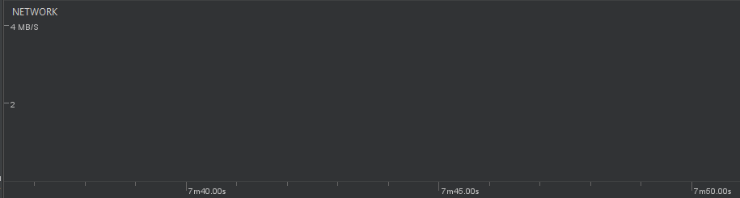
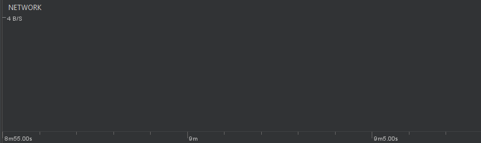
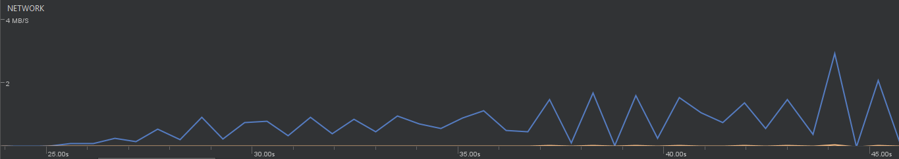

Verificando o uso de rede na aplicação
=============

Para realizar o teste de uso de rede durante a execução da aplicação, selecionamos as principais ações as quais um usuário pode realizar (ou não realizar), a fim de analisar quais situações são mais críticas nesse contexto. Foram selecionadas cinco situações, as quais são:

- **Situação 1:** Momento de ausência de interação, bem como a ausência de ações ocorrendo;
- **Situação 2:** Momento no qual um podcast está sendo ouvido pelo usuário;
- **Situação 3:** Momento no qual o download de um podcast está sendo realizado;
- **Situação 4:** Momento onde o usuário realiza um clique na tela;
- **Situação 5:** Momento no qual o usuário realiza diversos scrollings na aplicação;

Android Profiler
-----------------
Primeiramente, utilizamos o *Android Profiler* para obter informações a respeito do uso de rede durante essas ações. O *Android Profiler* é capaz de retornar essas informações em tempo real, dando uma representação visual do desempenho da aplicação ao longo do tempo.

Nas situações 1, 2, 4 e 5, não há uso de rede pela aplicação.

Na situação 3, há um uso intenso e regular de rede pela aplicação, uma vez que o download de um podcast está sendo realizado.

