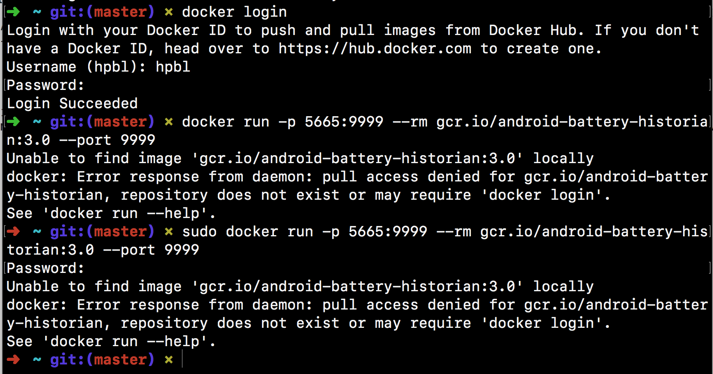
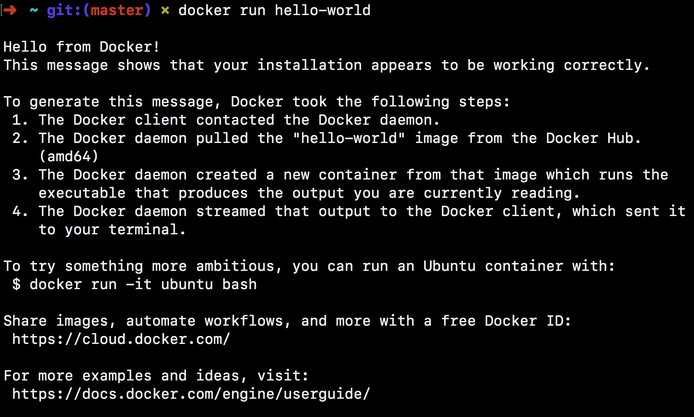

Análise do uso de bateria
-----

[@rrb explica aqui que tu mediu as paradas, gerou o txt e tudo mais]

Infelizmente foram enfrentados problemas com o uso do Battery Historian. Primeiramanete, tanto o README do próprio projeto, quanto o tutorial do android se encontram desatualizados.
Neles o próprio comando de `run` no docker está no modelo antigo. Após perceber isso, e conseguir adaptar o comando para a versão atual, ficamos presos em um erro que persistiu:

O erro persistiu mesmo fazendo todas as recomendações encontradas online nos issues do repo, nos fórums de docker, e no google (que não são muitas). E o Docker parece ter sido instalado corretamente:

