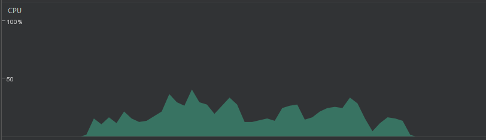

Verificando a performance da CPU na aplicação
=============

Para realizar o teste de performance da CPU durante a execução da aplicação, selecionamos as principais ações as quais um usuário pode realizar (ou não realizar), a fim de analisar quais situações são mais críticas nesse contexto. Foram selecionadas cinco situações, as quais são:

- **Situação 1:** Momento de ausência de interação, bem como a ausência de ações ocorrendo;
- **Situação 2:** Momento no qual um podcast está sendo ouvido pelo usuário;
- **Situação 3:** Momento no qual o download de um podcast está sendo realizado;
- **Situação 4:** Momento onde o usuário realiza um clique na tela;
- **Situação 5:** Momento no qual o usuário realiza diversos scrollings na aplicação;

Android Profiler
-----------------
Primeiramente, utilizamos o *Android Profiler* para obter informações a respeito da performance da CPU durante essas ações. O *Android Profiler* é capaz de retornar essas informações em tempo real, dando uma representação visual do desempenho da aplicação ao longo do tempo.

Na situação 1, não houveram mudanças no desempenho ao longo do tempo.

Na situação 2, também não houveram mudanças significativas no desempenho enquanto o podcast era tocado. Isso ocorre pois a execução de áudios não demanda muito processamento da máquina.

Na situação 3, Há um certo uso de processamento, porém esse uso não se mantém uniforme ao longo do tempo.

Na situação 4, Há picos de processamento nos momentos do clique. A imagem mostra esses picos, os quais representam os três cliques efetuados.

Na situação 5, Há um significativo nível de processamento ocorrido, uma vez que o scrolling traz a consequência de carregar visualmente mais elementos ao usuário.

