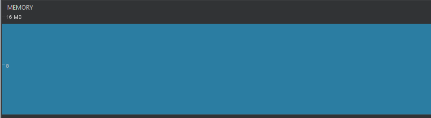

Verificando o uso de memória na aplicação
=============

Para realizar o teste de uso de memória durante a execução da aplicação, selecionamos as principais ações as quais um usuário pode realizar (ou não realizar), a fim de analisar quais situações são mais críticas nesse contexto. Foram selecionadas cinco situações, as quais são:

- **Situação 1:** Momento de ausência de interação, bem como a ausência de ações ocorrendo;
- **Situação 2:** Momento no qual um podcast está sendo ouvido pelo usuário;
- **Situação 3:** Momento no qual o download de um podcast está sendo realizado;
- **Situação 4:** Momento onde o usuário realiza um clique na tela;
- **Situação 5:** Momento no qual o usuário realiza diversos scrollings na aplicação;

Android Profiler
-----------------
Primeiramente, utilizamos o *Android Profiler* para obter informações a respeito do uso de memória durante essas ações. O *Android Profiler* é capaz de retornar essas informações em tempo real, dando uma representação visual do desempenho da aplicação ao longo do tempo.

Nas situações 1 e 2, o uso de memória manteve-se completamente regular durante o tempo.




Na situação 3, há um leve aumento no consumo de memória no momento de encerramento do download do podcast.


Na situação 4, há pequenos aumentos no consumo de memória ao serem realizados os cliques. Na imagem abaixo, pode-se observar dois desses aumentos, quando três cliques foram realizados.


Na situação 5, pode-se observar pequenos aumentos constantes no uso de memória ao serem realizados os scrollings.


LeakCanary
-----------------

O *LeakCanary* é uma biblioteca para *Android* e *Java*, a qual é responsável por detectar vazamentos no uso de memória, os quais podem ser evitados.

Pudemos realizar essa avaliação com o LeakCanary para as situações 2 e 3, e não houve a detecção de *memory leaks* pela interface do *LeakCanary*, como mostra a imagem. Para a situação 2, o teste da execução do podcast durou mais de 9 minutos.


Boas práticas de desenvolvimento
-----------------

**RecyclerView**

O widget *RecyclerView* é uma versão do *ListView*, no qual é um container capaz de exibir grandes conjuntos de dados, os quais podem ser rolados com mais eficiência quando mantendo um número limitado de visualizações. É interessante usar *RecyclerView* quando os dados coletados variam constantemente.

Segue abaixo o uso de *RecyclerView* num trecho de código da função `getView`, no qual gerencia se é necessário que a view seja reciclada ou reutilizada.

```Java
public View getView(int position, View convertView, ViewGroup parent) {
    final ViewHolder holder;
    if (convertView == null) {
        convertView = View.inflate(getContext(), linkResource, null);
        holder = new ViewHolder();
        holder.item_title = (TextView) convertView.findViewById(R.id.item_title);
        holder.item_date = (TextView) convertView.findViewById(R.id.item_date);
        holder.downloadButton = (Button) convertView.findViewById(R.id.item_action);
        convertView.setTag(holder);
    } else {
        holder = (ViewHolder) convertView.getTag();
    }
    ...
}
```
