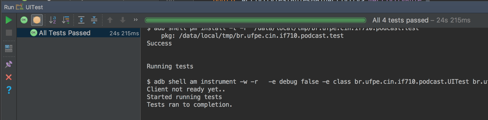

O que testar?
=============

Testes Unitários:
-----------------
 - **Parser do XML** (`XMLFeedParser`)
Resolvemos testar o Parser o XML, por ser parte integral do funcionamento do app. Caso o parser faça a leitura do XML de maneira correta, a aplicação não terá nenhum conteúdo para mostrar.

Como precisamos de um objeto do tipo `XmlPullParser` para passar como parâmetro às nossas funções que serão testadas, e não desejamos testar o funcionamento de um `XmlPullParser` de verdade, visto que é uma classe do Android, criamos um mock que será retornado por um método auxiliar:

```Java
   private static XmlPullParser mockParser() throws XmlPullParserException {
        XmlPullParserFactory factory = mock(XmlPullParserFactory.class);
        XmlPullParser xpp = mock(XmlPullParser.class);
        when(factory.newPullParser()).thenReturn(xpp);
        return xpp;
    }
```

 1.  Leitura do valor textual de uma tag (`readText`):
 
O método `readText` é responsável por retornar o valor textual da tag atual, então queremos testar se dada uma entrada, o resultado é o texto esperado.

```java
    @Test
    public void readText_returnsExpectedText() throws XmlPullParserException, IOException {
        String expected = "Texto teste";
    	XmlPullParser xpp = mockParser();
    	when(xpp.next()).thenReturn(XmlPullParser.TEXT);
    	when(xpp.getText()).thenReturn(expected);
    	String actual = XmlFeedParser.readText(xpp);
    	assertEquals(expected, actual);
    }
```

Definimos o comportamento do mock parser para ser análogo ao de um parser verdadeiro quando no método `readText`, definindo que o próximo elemento seria textual, e que ao pegar esse elemento, retornaria a String esperada. 

 2.  Leitura de uma tag de um Item (`readData`):

O método `readData` é utilizado para fazer o parse de uma tag completa, utilizando o `readText` para retornar o valor textual daquela da mesma.  Fizemos um teste para cada uma das tags de interesse, para garantir a leitura das informações.

```java
    @Test
    public void readData_returnsCorrectTitle() throws XmlPullParserException, IOException {
        String expected = "Oi tudo bom com você";

        XmlPullParser xpp = mockParser();
        PowerMockito.stub(PowerMockito.method(XmlFeedParser.class, "readText")).toReturn(expected);

        String actual = XmlFeedParser.readData(xpp, "title");
        assertEquals(expected, actual);
    }

    @Test
    public void readData_returnsCorrectGuid() throws XmlPullParserException, IOException {
        String expected = "http://frontdaciencia.ufrgs.br/#1";

        XmlPullParser xpp = mockParser();
        PowerMockito.stub(PowerMockito.method(XmlFeedParser.class, "readText")).toReturn(expected);

        String actual = XmlFeedParser.readData(xpp, "guid");
        assertEquals(expected, actual);
    }

    @Test
    public void readData_returnsCorrectPubDate() throws XmlPullParserException, IOException {
        String expected = "Sun, 20 Jun 2010 10:40:05 GMT";

        XmlPullParser xpp = mockParser();
        PowerMockito.stub(PowerMockito.method(XmlFeedParser.class, "readText")).toReturn(expected);

        String actual = XmlFeedParser.readData(xpp, "pubDate");
        assertEquals(expected, actual);
    }

    @Test
    public void readData_returnsCorrectDescription() throws XmlPullParserException, IOException {
        String expected = "Programa 1";

        XmlPullParser xpp = mockParser();
        PowerMockito.stub(PowerMockito.method(XmlFeedParser.class, "readText")).toReturn(expected);

        String actual = XmlFeedParser.readData(xpp, "description");
        assertEquals(expected, actual);
    }
```
Como o método sendo testado depende de um outro método estático da mesma classe (`readText`), utilizamos PowerMockito para fazer o *stubbing* deste último, para que seu funcionamento não interfira no teste, permitindo que o resultado do teste aponte o comportamento do `readData`.


 3.  Leitura da tag *enclosure* (`readEnclosure`):
 
Diferentemente das outras tags, *enclosure* é self-closing, e por isso necessita de um método próprio. Vamos testar se a função `readEnclosure` consegue ler a tag com sucesso, retornando o valor do atributo "url" onde consta o link para download do podcast.

``` java
    @Test
    public void readEnclosure_returnsCorrectUrl() throws XmlPullParserException, IOException {
        String expected = "https://hpbl.github.io/hub42_APS/audio/Oi%20Tudo%20Bom.mp3";

        XmlPullParser xpp = mockParser();
        when(xpp.getAttributeValue(null, "url")).thenReturn(expected);
        String actual = XmlFeedParser.readEnclosure(xpp);
        assertEquals(expected, actual);
    }
```


----------


Testes Integração:
-----------------

 - **Acesso ao Banco de Dados** `(PodcastProvider`/ `PodcastDBHelper`)
Decidimos testar o nosso ContentProvider, para tentar garantir que as operações de banco de dados foram implementadas corretamente.

Para realizar os testes num ambiente seguro, utilizamos a classe `ProviderTestCase2`. No seu construtor passamos a classe real do nosso ContentProvider, e sua authority:

```java
public class ContentProviderTest extends ProviderTestCase2<PodcastProvider> {

    @Before
    @Override
    public void setUp() throws Exception {
        super.setUp();

        ContentValues cv = new ContentValues();
        cv.put(PodcastProviderContract.EPISODE_TITLE, "hpbl e rrb");
        cv.put(PodcastProviderContract.EPISODE_DATE, "Tue, 12 Jun 1915 10:40:05 GMT");
        cv.put(PodcastProviderContract.EPISODE_LINK, "http://cin.ufpe.br/");
        cv.put(PodcastProviderContract.EPISODE_DESC, "Ótimos alunos");
        cv.put(PodcastProviderContract.EPISODE_DOWNLOAD_LINK, "https://hpbl.github.io/nota10.mp3");

        getMockContentResolver().insert(PodcastProviderContract.EPISODE_LIST_URI, cv);
    }

    public ContentProviderTest() {
        super(PodcastProvider.class, "br.ufpe.cin.if710.podcast.feed");
    }
```

Além disso, fizemos o override da função `setup` a ser rodada antes de cada teste, que insere no banco um podcast inicial, fazendo uso de um `ContentResolver` mock.


 1.  Inserção de podcast no banco
 
Neste teste verificamos que ao criar um novo `ContentValue`, com valores aceitáveis, o mesmo é inserido no banco corretamente:

 ```java
    @Test
    public void insertItemFeed_correctly() {
        ContentValues cv = new ContentValues();
        cv.put(PodcastProviderContract.EPISODE_TITLE, "Oi tudo bom com você");
        cv.put(PodcastProviderContract.EPISODE_DATE, "Sun, 20 Jun 2010 10:40:05 GMT");
        cv.put(PodcastProviderContract.EPISODE_LINK, "http://frontdaciencia.ufrgs.br/#1");
        cv.put(PodcastProviderContract.EPISODE_DESC, "Programa 1");
        cv.put(PodcastProviderContract.EPISODE_DOWNLOAD_LINK, "https://hpbl.github.io/hub42_APS/audio/Oi%20Tudo%20Bom.mp3");

        Uri insert_result = getMockContentResolver().insert(PodcastProviderContract.EPISODE_LIST_URI, cv);

        assertNotNull(insert_result);
    }
 ```


 2. Remoção de um podcast do banco

Neste teste verificamos que conseguimos remover um podcast que estava previamente no banco com sucesso:

```java
    @Test
    public void removeItemFeed_correctly() {
        String where = PodcastProviderContract.EPISODE_TITLE + "=?";
        String[] args = {"hpbl e rrb"};

        int remove_resut = getMockContentResolver().delete(
                PodcastProviderContract.EPISODE_LIST_URI,
                where,
                args);

        Assert.assertEquals(1, remove_resut);
    }
 ```

 
 3. Ler um podcast do banco

Neste teste verificamos que conseguimos fazer a query de um podcast que foi previamente inserido no banco com sucesso:

```java
    @Test
    public void queryItemFeed_correctly() {
        String selection = PodcastProviderContract.EPISODE_DESC + "=?";
        String[] args = {"Ótimos alunos"};

        Cursor queryResult = getMockContentResolver().query(
                                PodcastProviderContract.EPISODE_LIST_URI,
                                null,
                                selection,
                                args,
                                null);

        Assert.assertEquals(1, queryResult.getCount());
    }
```


 4. Erro ao ler um podcast que não existe no banco

 Neste teste verificamos se reamente não existe retorno quando tentamos fazer query de um podcast que nunca foi inserido no banco

```java
    @Test
    public void queryItemFeed_incorrectly() {
        String selection = PodcastProviderContract.EPISODE_DESC + "=?";
        String[] args = {"Péssimos alunos"};

        Cursor queryResult = getMockContentResolver().query(
                PodcastProviderContract.EPISODE_LIST_URI,
                null,
                selection,
                args,
                null);

        Assert.assertEquals(0, queryResult.getCount());
    }
```
 

 5. Atualizar um podcast do banco

 Neste teste verificamos que conseguimos atualizar os dados de um podcast que já existe no banco

 ```java
    @Test
    public void updateItemFeed_correctly() {
        ContentValues cv = new ContentValues();
        cv.put(PodcastProviderContract.EPISODE_TITLE, "Alunos nota 10");

        String where = PodcastProviderContract.EPISODE_DESC + "=?";
        String[] args = {"Ótimos alunos"};


        int update_count = getMockContentResolver().update(
                PodcastProviderContract.EPISODE_LIST_URI,
                cv,
                where,
                args);

        Assert.assertEquals(1, update_count);
    }
 ```


6. Inserir um podcast duplicado

Neste teste verificamos que ao tentar inserir um podcast que já existe no banco, o mesmo não é duplicado:

```java
    @Test
    public void notInserting_duplicateItemFeed() {
        ContentValues cv = new ContentValues();
        cv.put(PodcastProviderContract.EPISODE_TITLE, "hpbl e rrb");
        cv.put(PodcastProviderContract.EPISODE_DATE, "Tue, 12 Jun 1915 10:40:05 GMT");
        cv.put(PodcastProviderContract.EPISODE_LINK, "http://cin.ufpe.br/");
        cv.put(PodcastProviderContract.EPISODE_DESC, "Ótimos alunos");
        cv.put(PodcastProviderContract.EPISODE_DOWNLOAD_LINK, "https://hpbl.github.io/nota10.mp3");

        Uri insert_result = getMockContentResolver().insert(PodcastProviderContract.EPISODE_LIST_URI, cv);

        assertNotNull(insert_result);

        String selection = PodcastProviderContract.EPISODE_DESC + "=?";
        String[] args = {"Ótimos alunos"};

        Cursor queryResult = getMockContentResolver().query(
                PodcastProviderContract.EPISODE_LIST_URI,
                null,
                selection,
                args,
                null);

        Assert.assertEquals(1, queryResult.getCount());
    }
```

----------


Testes De Interface:
-----------------

Os testes de interface foram realizados usando Espresso, com o intuito de verificar se a interface foi disposta, e reage a ações corretamente.

Como todos os testes de interface a seguir dependem que a lista de podcasts já esteja apresentada, ou seja, dependem de uma ou mais tarefas assíncronas, utilizamos de uma subclasse de `IdlingResource` para que os testes sejam executados apenas após indicativo de sucesso no `FinishedDownloadingReceiver` da `MainActivity`.

```java
    public class MainActivityIdlingResource implements IdlingResource {

        private MainActivity activity;
        private ResourceCallback callback;

        public MainActivityIdlingResource(MainActivity activity) {
            this.activity = activity;
        }

        @Override
        public String getName() {
            return "MainActivityIdleName";
        }

        @Override
        public boolean isIdleNow() {
            Boolean idle = isIdle();
            if (idle) callback.onTransitionToIdle();
            return idle;
        }

        public boolean isIdle() {
            return activity != null && callback != null && activity.broadcastReceiver.getResultCode() == Activity.RESULT_OK;
        }

        @Override
        public void registerIdleTransitionCallback(ResourceCallback resourceCallback) {
            this.callback = resourceCallback;
        }
    }
```

Antes de rodar os testes fazemos o registro do `idlingResource` que é do tipo definido acima, e após, desfazemos:
```java
    private MainActivityIdlingResource idlingResource;

    @Rule
    public ActivityTestRule<MainActivity> mActivityRule =
            new ActivityTestRule(MainActivity.class);

    @Before
    public void registerIntentServiceIdlingResource() {
        MainActivity activity = this.mActivityRule.getActivity();
        this.idlingResource = new MainActivityIdlingResource(activity);
        registerIdlingResources(idlingResource);
    }

    @After
    public void unregisterIntentServiceIdlingResource() {
        unregisterIdlingResources(idlingResource);
    }

```

 1.  O primeiro podcast apresentado é o primeiro do XML?
 Queriamos saber se após fazer o parse do XML, e apresentar os resultados na tela, se foi mantida a ordem dos podcasts, sendo assim o primeiro a ser apresentado o que tem título: Ciência e Pseudociência
 
 ```java
     @Test
    public void firstPodcast_isCiencia() {
        String expected = "Ciência e Pseudociência";


        onData(anything())
                .inAdapterView(withId(R.id.items))
                .atPosition(0)
                .onChildView(withId(R.id.item_title))
                .check(matches(withText(expected)));
    }
```

2. O último podcast está com a data certa?
Queriamos saber se os dados dos podcasts estão condizentes, no caso, se o título do podcast bate com sua data de publicação.

```java
    @Test
    public void lastPodcast_hasRightDate() {
        String title = "Frontdaciência - T08E29 - Mario Bunge I";
        String expectedDate = "Mon, 18 Sep 2017 12:00:00 GMT";

        onData(withItemTitle(title))
                .inAdapterView(withId(R.id.items))
                .onChildView(withId(R.id.item_date))
                .check(matches(withText(expectedDate)));
    }
```

Para conseguir a referência ao item específico da lista, criamos um FeatureMatcher que vai conferir se o item tem o título desejado:

```java
    private static FeatureMatcher<ItemFeed, String> withItemTitle(final String itemTitle) {
        return new FeatureMatcher<ItemFeed, String>(equalTo(itemTitle), "with itemTitle", "itemTitle") {
            @Override
            protected String featureValueOf(ItemFeed actual) {
                return actual.getTitle();
            }
        };
    }
```


3. Os dados passados pra tela de detalhes estão certos?
Queriamos saber se quando o usuário tocar num podcast da lista, os detalhes apresentados na activity seguinte são realmente do podcast selecionado.

```java
    @Test
    public void tap_showsRightDetails() {
        String title = "O Homem foi mesmo até a Lua?";
        String description = "Programa 2";
        String date = "Sun, 20 Jun 2010 10:45:05 GMT";

        onData(withItemTitle(title))
                .inAdapterView(withId(R.id.items))
                .onChildView(withId(R.id.item_title))
                .perform(click());


        // on EpisodeDetailActivity
        onView(withId(R.id.title_tv))
                .check(matches(withText(title)));

        onView(withId(R.id.description_tv))
                .check(matches(withText(description)));

        onView(withId(R.id.pubDate_tv))
                .check(matches(withText(date)));
    }
```




